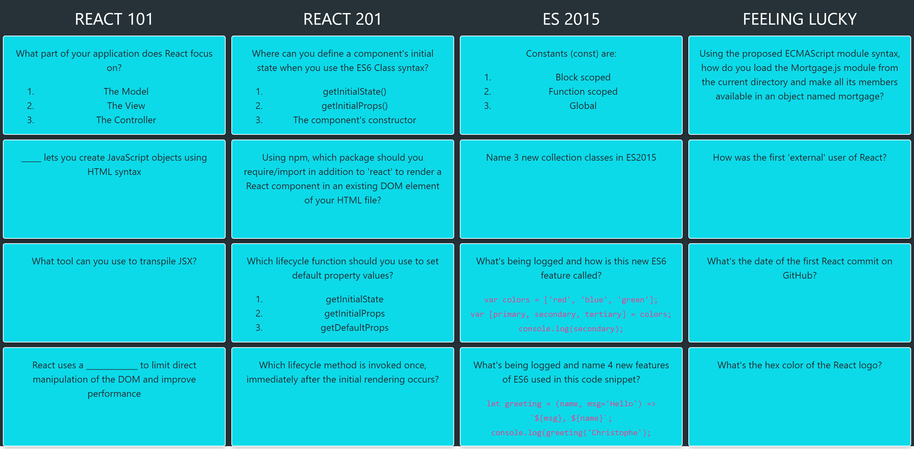

[](https://circleci.com/gh/reshufflehq/blank)

This is a [Reshuffle](https://reshuffle.com/) template.

## About

React trivia game is a game where you flip cards to see answers to the questions presented.

Each column is a category of questions, and once you click on a card, it will flip to display its answer.

This project demonstrates the use of Reshuffle platform and react js and was inspired from [react-trivia](https://github.com/ccoenraets/react-trivia) repository.

## Screenshots



## Data

Trivia questions array, questions by category.

Sample data:

```json
[
  {
    "category": "Feeling Lucky",
    "questions": [
      {
        "points": 100,
        "question": "Using the proposed ECMAScript module syntax, how do you load the Mortgage.js module from the current directory and make all its members available in an object named mortgage?",
        "answer": "<code>import * as mortgage from './Mortgage';</code>"
      },
      {
        "points": 200,
        "question": "Which first 'external' feature was written in React?",
        "answer": "Instagram's feed"
      },
      {
        "points": 300,
        "question": "What's the date of the first React commit on GitHub?",
        "answer": "May 29th, 2013"
      },
      {
        "points": 400,
        "question": "What's the hex color of the React logo?",
        "answer": "#61DAFB"
      }
    ]
  }
]
```

## Future Features List

- Support scoring system
- Store answers in backend
- Multiplayer game
